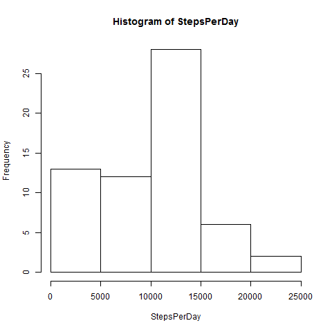
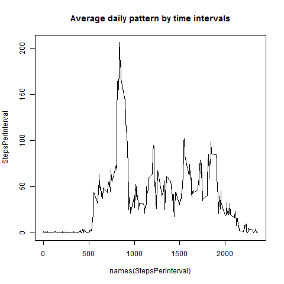
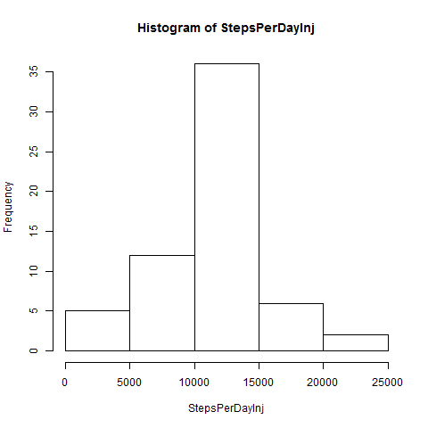
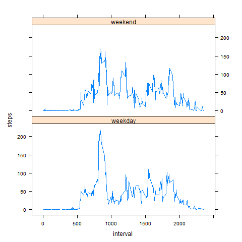

Peer-graded Assignment: Course Project 1
===================================================
Loading and preprocessing the data


```r
url='https://d396qusza40orc.cloudfront.net/repdata%2Fdata%2Factivity.zip'
zipfile='repdata%2Fdata%2Factivity.zip'
file='activity.csv'

if (!file.exists(zipfile)){
  url
  download.file(url,zipfile)
}  


if (!file.exists(file)){
  unzip(zipfile)
}  

DataIn<-read.csv(file)
```

What is the average daily activity pattern?


```r
StepsPerDay<-tapply(DataIn$steps,DataIn$date,sum,na.rm=TRUE)
hist(StepsPerDay)
```



```r
print("The average number of steps per Day:")
```

```
## [1] "The average number of steps per Day:"
```

```r
mean(StepsPerDay)
```

```
## [1] 9354.23
```

```r
print("The median of number of steps per Day:")
```

```
## [1] "The median of number of steps per Day:"
```

```r
median(StepsPerDay)
```

```
## [1] 10395
```

```r
StepsPerInterval<-tapply(DataIn$steps,DataIn$interval,mean,na.rm=TRUE)
plot(y=StepsPerInterval,x=names(StepsPerInterval),type='l',main="Average daily pattern by time intervals")
```



```r
print("The interval with the maximum number of steps:")
```

```
## [1] "The interval with the maximum number of steps:"
```

```r
StepsPerInterval[StepsPerInterval==max(StepsPerInterval)]
```

```
##      835 
## 206.1698
```

Check for missing values and report the number of NAs:

```r
sum(is.na(DataIn$steps))
```

```
## [1] 2304
```

```r
sum(is.na(DataIn$date))
```

```
## [1] 0
```

```r
sum(is.na(DataIn$interval))
```

```
## [1] 0
```
Imputing missing values with the interval mean

```r
Means<-data.frame(as.numeric(StepsPerInterval),names(StepsPerInterval))
names(Means)<-c('intervalMean','interval')
DataInjected<-merge(DataIn,Means,by='interval')
DataInjected$steps[is.na(DataInjected$steps)]<-DataInjected$intervalMean[is.na(DataInjected$steps)]
DataInjected<-DataInjected[,1:3]
```
Histogram of steps for the data with NA replaced by means

```r
StepsPerDayInj<-tapply(DataInjected$steps,DataInjected$date,sum,na.rm=TRUE)
hist(StepsPerDayInj)
```



```r
print("The average number of steps per Day:")
```

```
## [1] "The average number of steps per Day:"
```

```r
mean(StepsPerDayInj)
```

```
## [1] 10766.19
```

```r
print("The median of number of steps per Day:")
```

```
## [1] "The median of number of steps per Day:"
```

```r
median(StepsPerDayInj)
```

```
## [1] 10766.19
```
Are there differences in activity patterns between weekdays and weekends?


```r
DataInjected$Weekdaynum<-as.POSIXlt(DataInjected$date)$wday
DataInjected$Weekend[(DataInjected$Weekdaynum==0|DataInjected$Weekdaynum==1)]<-c("weekend")
DataInjected$Weekend[(DataInjected$Weekdaynum!=0&DataInjected$Weekdaynum!=1)]<-c("weekday")
DataInjected$Weekend<-factor(DataInjected$Weekend)

MeansWeekdayWeekend<-aggregate(steps~interval+Weekend,DataInjected,mean)

install.packages("lattice")
```

```
## Error in install.packages : Updating loaded packages
```

```r
library(lattice)
xyplot(steps~interval|factor(Weekend),data=MeansWeekdayWeekend,aspect=1/2,type="l")
```


